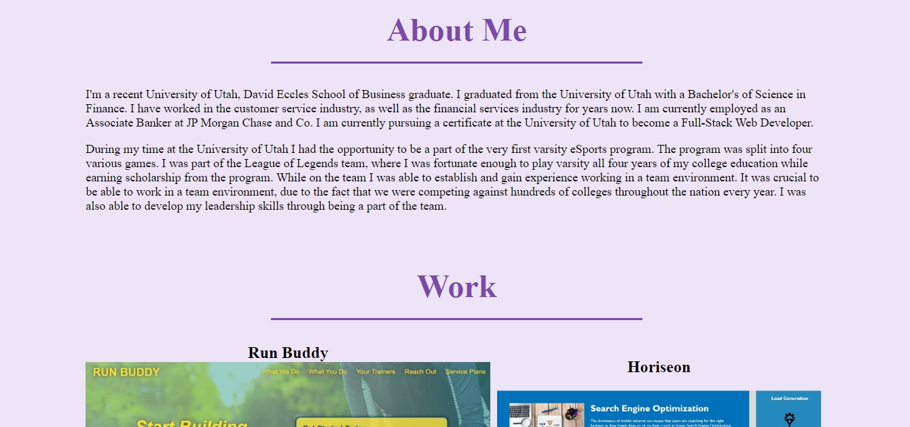

# Challenge 2 - Portfolio

## Purpose

A portfolio of work showcases the talents and skill to employers. Having a portfolio allows employers to view your work. Effective portfolios highlight good work, and the code behind it.

## Task
In Challenge 2, the task was to create a portfolio from scratch, and include:
- Developer's name, photo, and links to their contact information and work.
- Navigation links lead to corresponding section.
- Application image deploys the link to the application.
- Resizing the page gives a responsive layout.

## Screenshots

## URL
https://thomasnguyen546.github.io/Portfolio